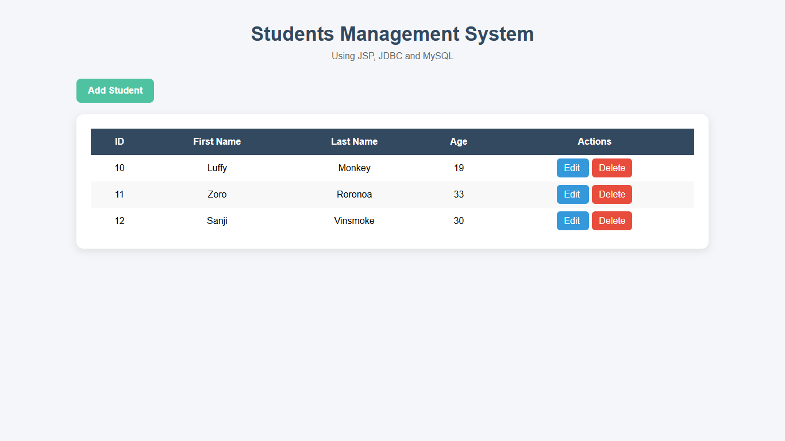
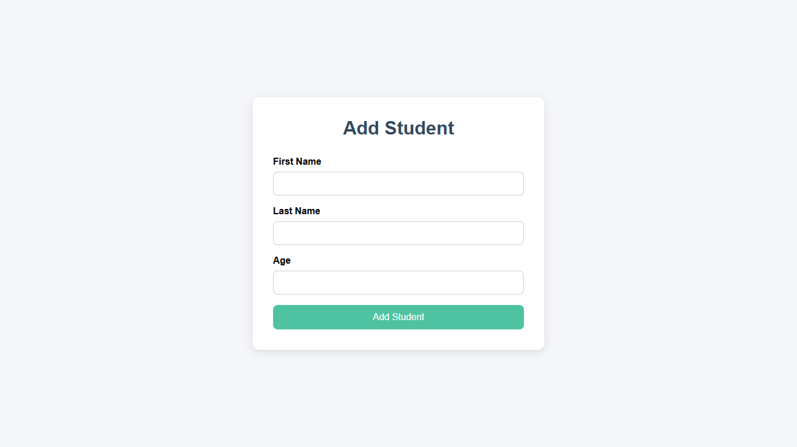
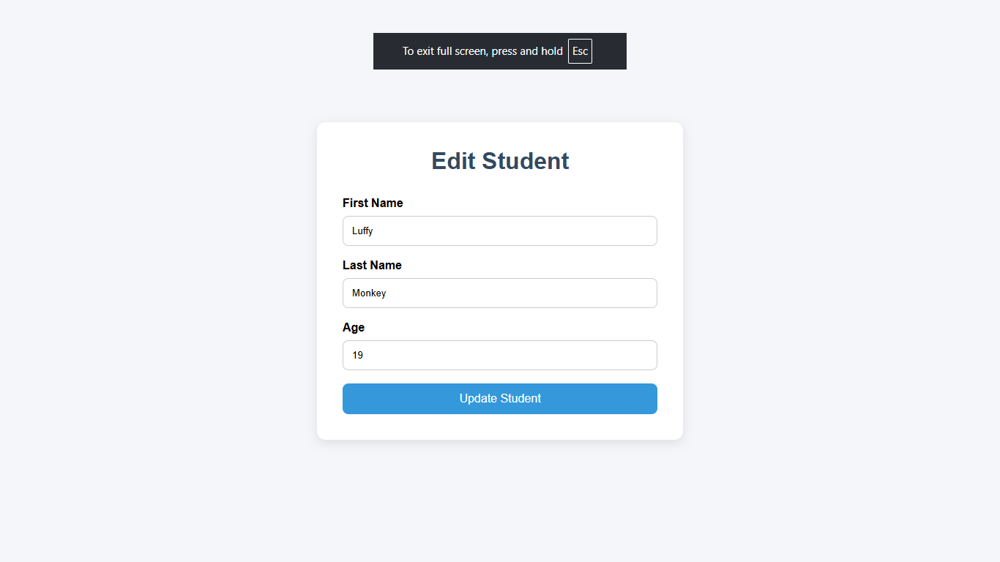
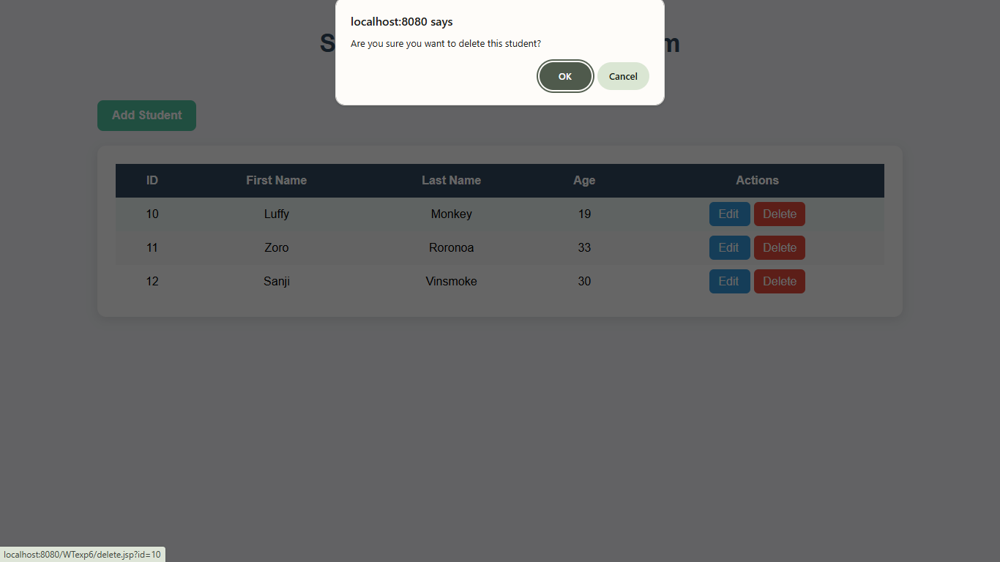

# 📘 Student Management System using JSP, JDBC & MySQL


A simple CRUD-based Student Management System developed using JSP, JDBC and MySQL.  
This application allows users to add, view, update and delete student records through a clean and responsive web interface.

---

# ✨ Features

- ➕ Add new student records
- 📋 View all students in table format
- ✏️ Update existing student details
- ❌ Delete student records
- ⚠️ Delete confirmation popup
- ✅ Success messages after CRUD operations
- 🎨 Responsive and modern UI design
- 🔐 Uses `PreparedStatement` for database operations

---

# 🛠️ Technologies Used

- Java 8
- JSP (Java Server Pages)
- JDBC
- MySQL
- Apache Tomcat
- HTML5
- CSS3

---

# 📂 Project Structure

```bash
StudentManagementSystem/
│
├── add.jsp
├── edit.jsp
├── delete.jsp
├── index.jsp
│
├── WEB-INF/
│   └── web.xml
│
└── lib/
    └── mysql-connector-java-8.x.x.jar
```

---

# 🗄️ Database Setup

## Create Database

```sql
CREATE DATABASE student_manager;
```

## Create Table

```sql
USE student_manager;

CREATE TABLE students (
    id INT PRIMARY KEY AUTO_INCREMENT,
    firstname VARCHAR(100),
    lastname VARCHAR(100),
    age INT
);
```

---

# ⚙️ Configure Database Connection

Update database credentials in JSP files if needed:

```java
String connectionUrl = "jdbc:mysql://localhost:3306/";
String database = "student_manager";
String userid = "root";
String password = "";
```

---

# 🚀 How to Run

1. Install Java 8 or later
2. Install Apache Tomcat
3. Install MySQL or Laragon
4. Create the database and table
5. Import the project into Eclipse/STS
6. Add MySQL Connector JAR to project libraries
7. Run the project on Tomcat server

Open in browser:

```bash
http://localhost:8080/StudentManagementSystem/
```

---

# 📸 Screenshots

## Home Page



## Add Student Page



## Edit Student Page



## Delete Student Page



---

# 📚 CRUD Operations Implemented

| Operation | Description |
|---|---|
| Create | Add new student |
| Read | View all students |
| Update | Edit student details |
| Delete | Remove student record |

---

## 📌 Note

This project is intentionally implemented using **JSP, JDBC and MySQLi without frameworks** to demonstrate strong understanding of CRUD operations, SQL queries, and server-side scripting fundamentals.